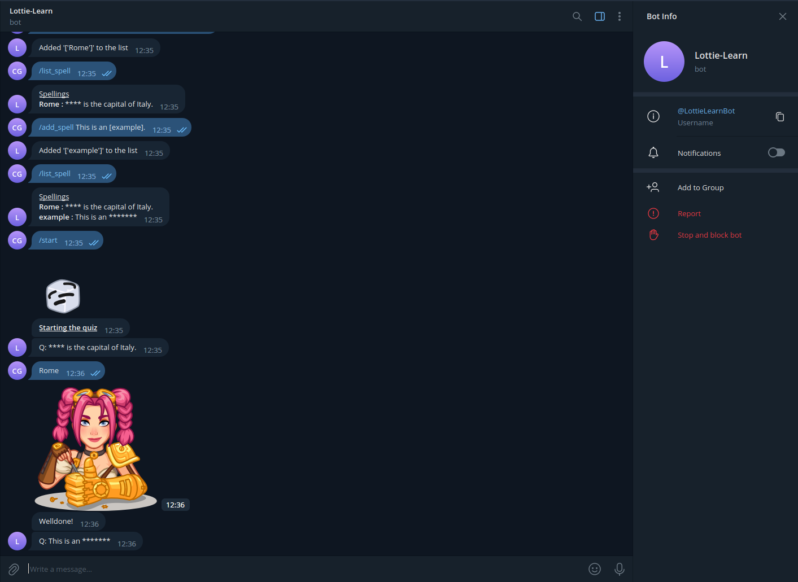

# Lottie-Learn
Learning app that runs as a Telegram Bot...as in you access it from the Telegram app. 

## Installing as a Docker image

Dependencies:

* Linux
* Docker

Build the docker image:

    $ sudo docker build -t lottie-learn .

## Running within Docker

To run the container / app, you will need a Telegram Token.  Install and create an account with Telegram.  Within the app search for "BotFather" and 
send the /newbot message to it.  Follow the instructions to create a new bot, making sure to store the API key somewhere safe.

On your server, run the container:

    $ sudo docker run -d --name lottie-learn -e TOKEN={API-KEY} lottie-learn

{API-KEY} is the Telegram bot's key given to you by BotFather. 

## Running manually

To run manually, run the bot.py program from the command line like so:

    $ python3 ./src/bot.py --token {API-KEY}

Again, {API-KEY} is the Telegram bot's key given to you by BotFather. 
